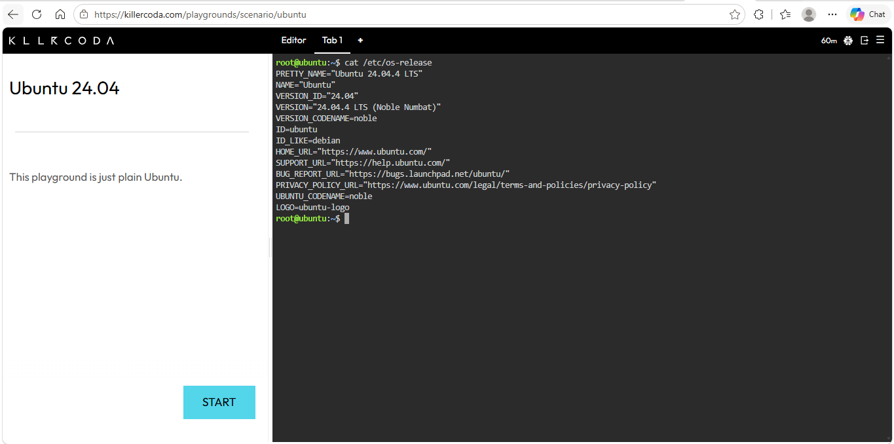
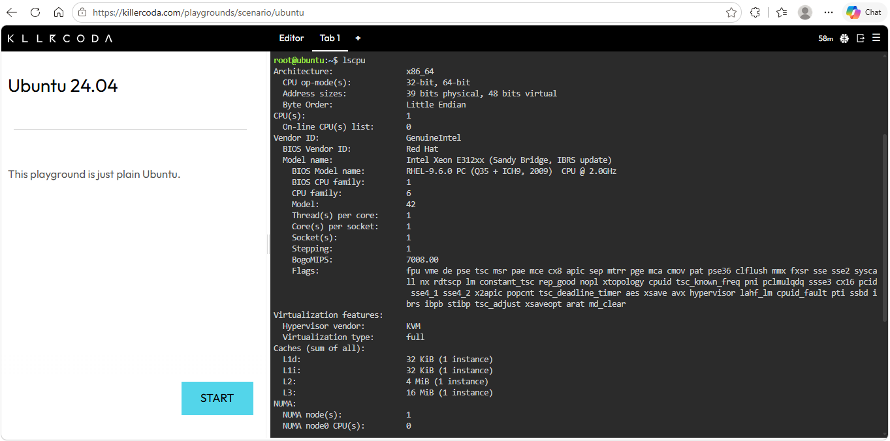
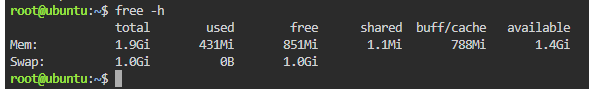
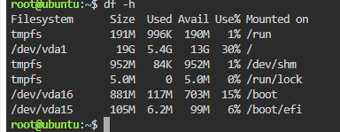

# Linux Server Investigation

## 1. Operating System

The Linux server is running **Ubuntu 24.04 LTS**.

The operating system information was collected using the `cat /etc/os-release` command.

---

## 2. CPU Information

The server uses an **Intel Xeon E312xx processor** with **1 CPU**.

The CPU information was collected using the `lscpu` command.

---

## 3. Memory

The server has approximately **1.9 GiB of RAM**.

The memory information was collected using the `free -h` command.

---

## 4. Disk Space

The server has a **19 GB** root filesystem (`/dev/vda1`), with approximately **549 MB used** and **18 GB available**.

The disk information was collected using the `df -h` command.

---

## 5. Cloud Migration

If this Linux server were migrated to the cloud, it could be hosted using virtual machine services from AWS, Microsoft Azure, and Google Cloud Platform.

| Cloud Platform | Service | Purpose |
|---|---|---|
| AWS | Amazon EC2 | Hosts Linux virtual machines and runs server workloads in the AWS Cloud. |
| Microsoft Azure | Azure Virtual Machines | Provides virtual machines that can run Linux operating systems and applications. |
| Google Cloud Platform | Compute Engine | Provides virtual machines for running Linux servers and workloads in Google Cloud. |

### AWS – Amazon EC2

Amazon EC2 could host this Linux server as a virtual machine. The server's CPU, memory, and storage requirements can be configured through an appropriate EC2 instance.

### Microsoft Azure – Azure Virtual Machines

Azure Virtual Machines could be used to migrate and run the Ubuntu Linux server in the Azure Cloud. The virtual machine can be configured with suitable computing, memory, and storage resources.

### Google Cloud Platform – Compute Engine

Google Compute Engine could host the Ubuntu Linux server as a virtual machine. It provides configurable computing resources for running Linux-based applications and workloads.

---

## 6. Summary

The investigated server is running **Ubuntu 24.04 LTS** with an **Intel Xeon E312xx CPU, approximately 1.9 GiB of memory, and a 19 GB root filesystem**. If migrated to the cloud, equivalent virtual machine services are **Amazon EC2**, **Azure Virtual Machines**, and **Google Compute Engine**.
